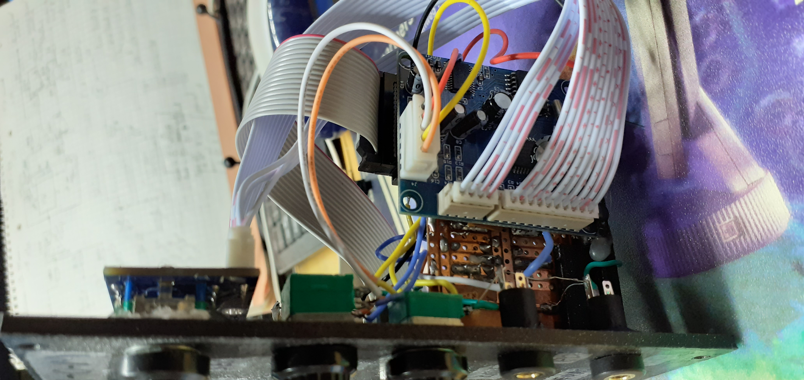

# Reverb-O-Matic

This is euro rack reverb module based on a 100 Reverb FX board, sold via Chinese resellers for less than 15 USD (price Sept 2020).

A video demonstrating the module can be found here: https://youtu.be/npN-3Wpyl-M

You can find a schematic describing the circuitry I added to adapt signal levels to euro rack level conventions here:

and an STL-file to 3D-print a front panel for the module.

This is a list of the 100 reverbs:

00~02 small hall

03~05 medium hall

06~08 large hall

09    church

10~12 small room

13~15 medium room

16~18 large room

19    hal,84~85 Reverb+phase shift

20~26 with metal acoustic reverb

27~29 Spring reverberation

30~35 Reverberation door

36~39 Reverse reverb

40~43 Early reflection

44~47 Atmosphere effect

48    stadium

49    Ambient effect FX

50~58 Delay

59    echo

60~65 chorus

66~69 Flange

70~73 Phase shift

74~79 Tone

80-81 Reverb+chorus

82~83 Reverb+chrome

86~87 Reverb+tone

88~89 Delay+reverb

90 Delay+reverberation gate

91 Delay+reverse reverb

92~93 Delay+chorus

94~95 Delay+chrome

96~97 Delay+phase shift

98~99 Delay+transposition
